# Savior

> 사용자 조건을 바탕으로 맞춤 복지를 추천하고 검색·상세 조회·저장까지 연결하는 복지 정보 탐색 서비스

<p align="center">
  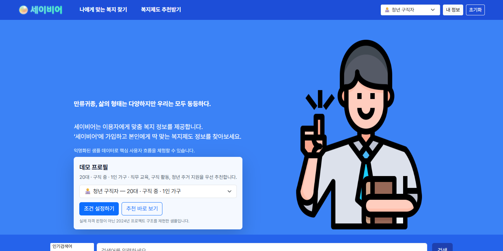
</p>

---

## 01. 프로젝트 개요

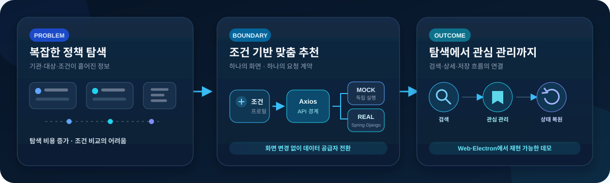

### 해결하려는 문제와 서비스

- **문제**: 제공 기관·대상 조건이 흩어진 복지 제도와 복잡한 탐색 과정
- **해결**: 연령대·직업·자녀·가구 조건을 묶은 추천, 검색, 상세, 관심 관리 흐름
- **사용 경험**: 분야별 분포, 인기 키워드, 지원 대상·선정 기준·신청 방법, 찜·이용 상태 확인
- **제공 환경**: 하나의 React 화면을 공유하는 Web·Electron
- **기본 실행**: 가상 페르소나와 로컬 샘플 데이터 기반 Mock 데모. 규칙 기반 추천이며 실제 복지 자격 판정·Django 알고리즘 결과와 분리

### 프로젝트 정보

| 구분 | 내용 |
| --- | --- |
| 개발 기간 | 2024.02.26 ~ 2024.04.04 |
| 팀 규모 | 5명 |
| 제공 형태 | Web · Electron |

---

## 02. 팀과 기여

### 팀 구성과 담당 역할

<table width="100%">
  <tr>
    <td align="center" valign="middle" width="120">
      <a href="https://github.com/andongmin94">
        <br>
        <strong>andongmin94</strong>
      </a>
    </td>
    <td valign="middle">
      <strong>Frontend · Desktop · API 통합</strong><br>
      <sub><strong>Frontend UI</strong> — 조건·추천·검색·상세·프로필</sub><br>
      <sub><strong>상태·API</strong> — Redux, Spring·Django Axios 경계</sub><br>
      <sub><strong>Desktop</strong> — Electron 창·트레이·IPC·생명주기</sub><br>
      <sub><strong>Demo·Quality</strong> — Mock/Real adapter·상태 복원·회귀 테스트</sub><br>
    </td>
  </tr>
  <tr>
    <td align="center" valign="middle" width="120">
      <a href="https://github.com/Hyun-Jik">
        <br>
        <strong>Hyun-Jik</strong>
      </a>
    </td>
    <td valign="middle">
      <strong>Frontend UI · 상태 구조</strong><br>
      <sub><strong>Frontend UI</strong> — 메인·프로필·검색·필터·사용자 화면</sub><br>
      <sub><strong>공통 구조</strong> — 스타일 시스템·Frontend 상태 구조</sub><br>
    </td>
  </tr>
  <tr>
    <td align="center" valign="middle" width="120">
      <a href="https://github.com/malrangcow00">
        <br>
        <strong>malrangcow00</strong>
      </a>
    </td>
    <td valign="middle">
      <strong>Django · 추천 시스템</strong><br>
      <sub><strong>Recommendation</strong> — 28개 특성 전처리·DBSCAN·유사도 분석</sub><br>
      <sub><strong>Django API</strong> — 사용자 군집 갱신·추천 REST API</sub><br>
      <sub><strong>Distribution</strong> — S3 앱 파일 API</sub><br>
    </td>
  </tr>
  <tr>
    <td align="center" valign="middle" width="120">
      <a href="https://github.com/jjo2889">
        <br>
        <strong>jjo2889</strong>
      </a>
    </td>
    <td valign="middle">
      <strong>Spring Boot · 인증/서비스 API</strong><br>
      <sub><strong>Service API</strong> — 사용자·복지·찜·이용 API·JPA Repository</sub><br>
      <sub><strong>Auth</strong> — Kakao OAuth2·JWT</sub><br>
      <sub><strong>Integration</strong> — 조건 저장·Django 군집 갱신 경계</sub><br>
    </td>
  </tr>
  <tr>
    <td align="center" valign="middle" width="120">
      <a href="https://github.com/eunalove">
        <br>
        <strong>eunalove</strong>
      </a>
    </td>
    <td valign="middle">
      <strong>Infrastructure · 배포 환경</strong><br>
      <sub><strong>Container</strong> — Spring Boot·React Docker 구성</sub><br>
      <sub><strong>Environment</strong> — CORS·서버 주소·민감 설정 분리</sub><br>
    </td>
  </tr>
</table>

### 담당 영역 및 구체적인 기여

#### 구현 소유 경계

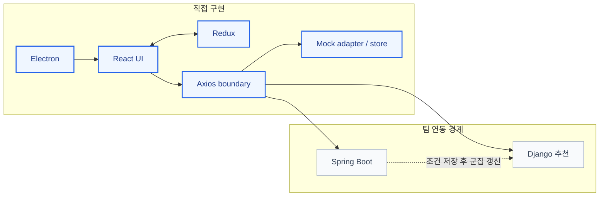

> 파란색: 직접 구현 · 회색: 팀 연동 경계

#### 핵심 구현

- 조건 설정 → 추천 → 검색 → 상세 → 프로필의 React 화면과 공통 컴포넌트 구현
- 검색어·추천·사용자 조건·찜·이용 상태를 공유하는 Redux 흐름과 화면 이동 상태 유지
- Spring Boot 사용자·복지 API와 Django 사용자 군집 API를 분리한 Axios 경계
- Web·Electron 공용 renderer, 프레임리스 창, 타이틀바, 트레이, 단축키, 앱 생명주기 구현
- Node.js 접근 차단, 최소 preload IPC, 외부 링크의 기본 브라우저 위임
- 동일 화면에서 adapter만 교체하는 Mock/Real 전환 구조
- 3개 페르소나·샘플 복지와 버전화된 localStorage 기반 조건·찜·이용·검색·조회 상태
- Spring Boot·Django 응답 계약을 재현한 Mock API·회귀 테스트, HashRouter·상대 경로 독립 빌드

---

## 03. 사용자 경험

### 대표 화면

| 맞춤 복지 추천 | 통합 검색 |
| --- | --- |
| 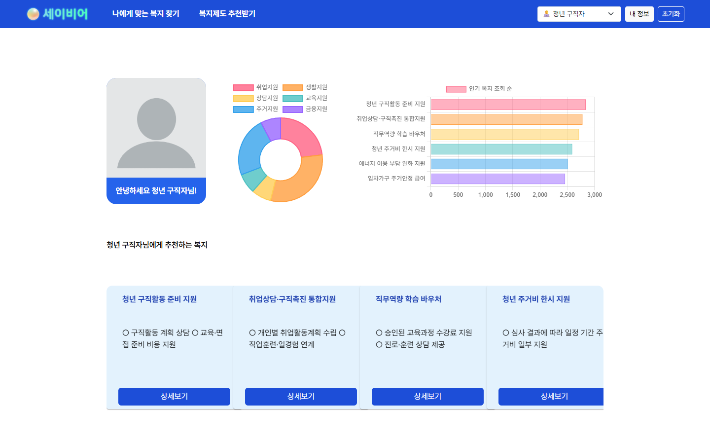 | 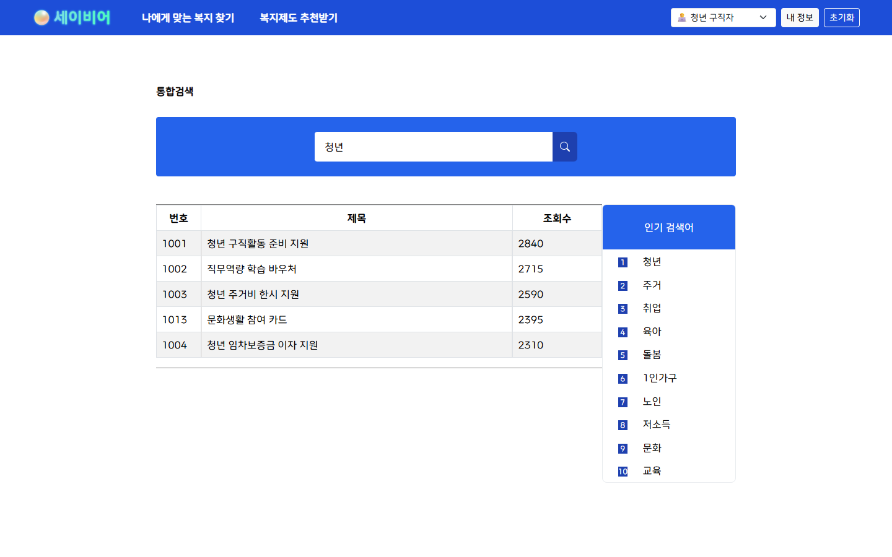 |
| 조건별 추천 복지, 분야 분포, 같은 그룹 인기 복지 | 검색 결과·조회수·인기 검색어 비교와 상세 이동 |

### 핵심 사용자 흐름

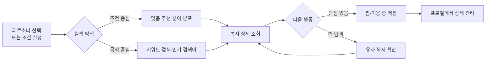

1. 데모 페르소나 선택 또는 직업·자녀·가구 조건 설정
2. 추천 카드·분야 분포·그룹 인기 복지 확인
3. 검색어·인기 키워드를 통한 복지 탐색과 상세 이동
4. 대상·선정 기준·지원 내용·신청 방법·유사 복지 확인
5. 찜·이용·프로필 조건의 브라우저 저장과 새로고침 복원

### 주요 기능

| 기능 | 사용자 경험 | 구현·데이터 흐름 |
| --- | --- | --- |
| 가상 페르소나 | 청년 구직자·영유아 양육 가정·시니어 1인 가구를 즉시 전환 | 페르소나별 프로필과 초기 추천·찜·이용 상태 제공 |
| 조건 설정 | 연령·성별·직업·자녀·가구 특성 입력 | 직업·자녀·가구 특성은 추천 재정렬, 연령·성별은 프로필에 저장 |
| 맞춤 추천 | 추천 카드, 분야별 도넛 차트, 그룹 인기 복지 확인 | 페르소나 기본 목록을 조건에 따라 재정렬 |
| 통합 검색 | 키워드 검색, 인기 검색어, 페이지네이션 | 복지명·내용·대상·태그를 검색하고 조회수순 정렬 |
| 상세 조회 | 대상·선정 기준·지원 내용·신청 방법·연관 복지 확인 | 상세 진입 시 조회수 증가, 공통 태그 기반 연관 복지 제공 |
| 관심 관리 | 찜과 이용 중 상태를 추가·해제 | 페르소나별 localStorage 상태 유지 |
| Web·Desktop | 브라우저와 설치형 앱에서 같은 화면 사용 | Vite 정적 빌드를 Electron이 로드 |

---

## 04. 설계와 구현

### 전체 시스템 구조

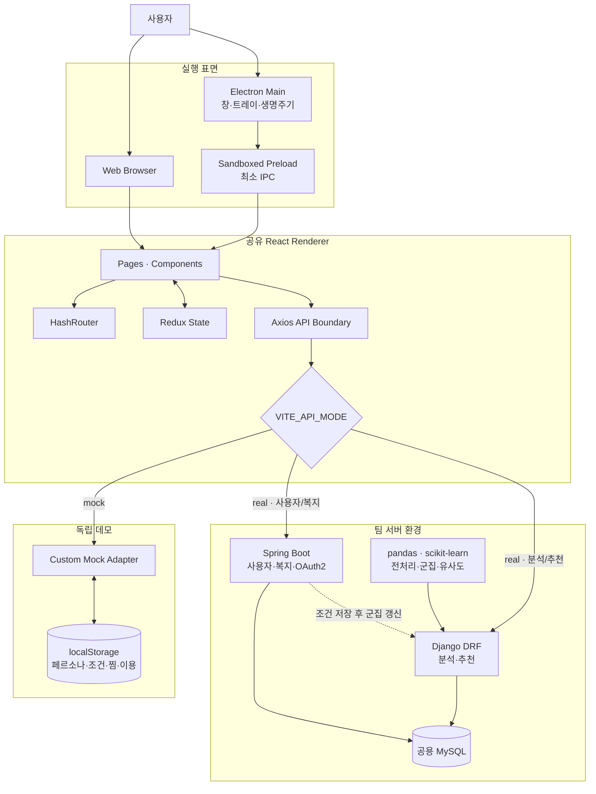

<details>
<summary>2024년 팀 설계 원본 보기</summary>

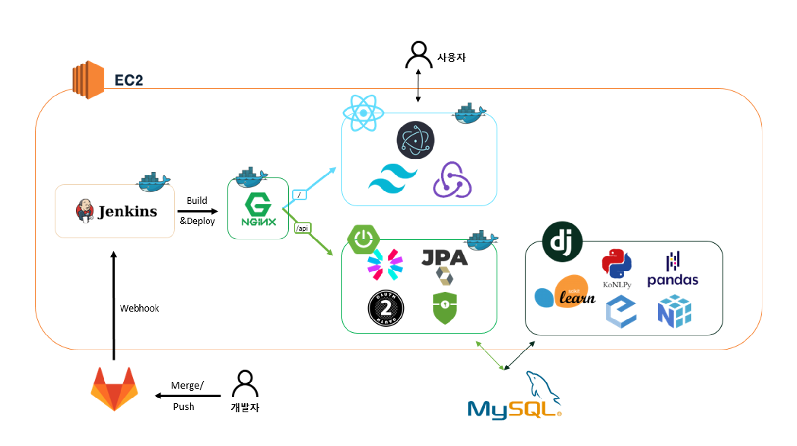

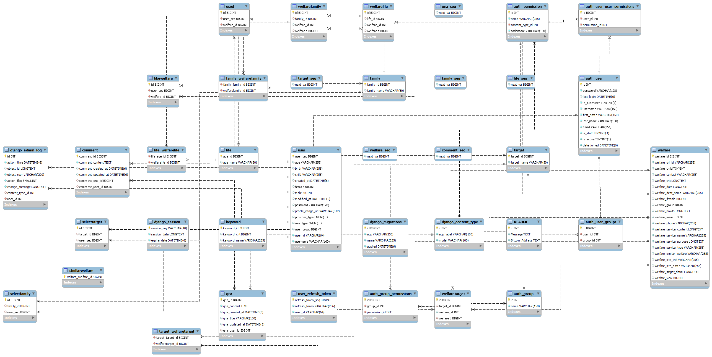

</details>

- **React**: Spring Boot·Django 응답 계약을 공유하는 화면 계층
- **Mock**: 동일 Axios 요청을 adapter에서 처리하는 샘플 응답
- **Real**: 환경 변수로 지정한 Spring Boot·Django 서버 호출
- **Data**: 원 시스템에서 두 백엔드가 참조한 공용 MySQL 사용자·복지 데이터

### 핵심 기술 구현

#### API 경계를 유지한 Mock·Real 전환

- 공통 Axios client에만 선택적으로 주입되는 Mock adapter
- 모드와 무관하게 유지되는 `/api/users`, `/api/welfare`, Django 사용자 군집 호출
- 환경 변수 하나로 교체되는 데이터 공급자

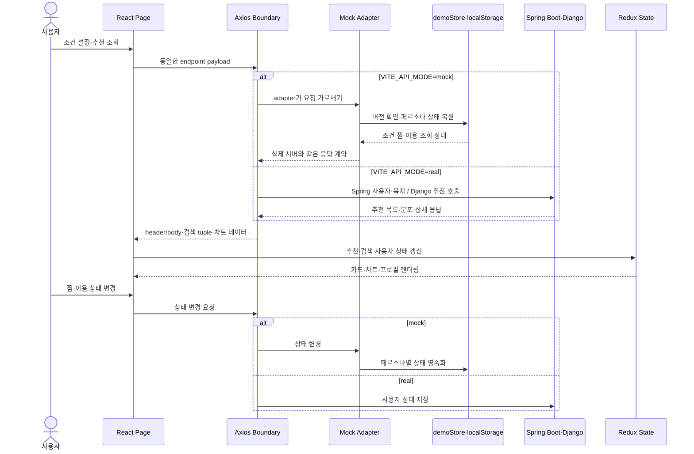

- `header/body`, 검색 tuple, 추천 차트 데이터를 포함한 기존 응답 계약
- 미등록 경로의 명시적 404와 계약 누락 탐지

#### 지속 가능한 데모 상태

- 버전화된 단일 상태: 페르소나별 프로필·조건·찜·이용, 키워드 횟수, 조회수 증가분
- localStorage 차단 시 메모리 fallback, 변경 이벤트 기반 화면 동기화
- 실제 인증과 분리된 로그인 분기용 Mock 세션 식별자

#### React·Electron 단일 빌드

- `HashRouter`·상대 `base`를 통한 정적 하위 경로와 Electron `file://` 공용 `dist`
- Node.js 접근 차단과 숨김·최소화·최대화만 노출하는 preload

#### 팀 추천 파이프라인

- 28차원 이진 벡터: 생애주기 5, 직업·대상 6, 자녀 2, 성별 2, 가구 특성 13

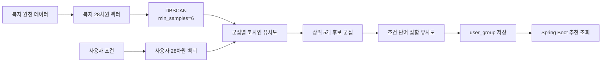

- **산출물**: 복지 3,516건, 군집 49개, Noise 276건
- **유사 복지**: 28개 조건 벡터와 설명 TF-IDF의 결합 유사도
- **평가 한계**: 정답 목록·사용자 평가 데이터 부재로 정확도·정밀도·재현율 미측정

### 기술적 의사결정과 해결한 문제

| 문제 | 선택한 방식 | 결과와 고려사항 |
| --- | --- | --- |
| 팀 서버 종료 후 화면을 재현하기 어려움 | 기존 Axios 계약을 구현한 Mock adapter | UI를 바꾸지 않고 독립 실행 가능. 실제 자격 판정·ML 결과는 재현하지 않음 |
| 브라우저와 Electron의 하위 경로 로딩 차이 | `HashRouter` + Vite `base: "./"` | 정적 서버 fallback 없이 `file://`에서도 동작 |
| 페르소나 변경 후 상태가 새로고침으로 사라짐 | 버전화된 localStorage store | 조건·찜·이용 흐름을 연속적으로 시연. 실제 다중 사용자 DB를 대체하지는 않음 |
| renderer의 Electron 권한이 넓어질 위험 | context isolation·sandbox·최소 preload IPC | React 코드가 Electron 전체 API와 Node.js에 직접 접근하지 않음 |
| 복합 조건을 단순 문자열 검색으로 추천하기 어려움 | 28개 이진 특성 + DBSCAN + 코사인·집합 유사도 | 명시적인 조건 공간에서 후보 군집 생성. 소득·지역·세부 자격은 제한적으로 표현 |
| 관련 복지를 조건만으로 찾을 때 설명 의미가 빠짐 | 조건 유사도와 TF-IDF 텍스트 유사도 결합 | 구조화 조건과 설명 문맥을 함께 반영. 별도 정답 데이터 평가는 미수행 |

### 기술 스택

| 구분 | 기술 |
| --- | --- |
| Frontend | React 18, React Router 6, Redux 5, Axios, MUI, React Bootstrap, Tailwind CSS, Swiper, Chart.js, Vite |
| Desktop | Electron, electron-builder |
| Spring Boot | Java 17, Spring Boot 3.2.3, Spring Security, OAuth2, JWT, JPA, MySQL |
| Django·Data | Python, Django 5.0.3, Django REST Framework, pandas, NumPy, scikit-learn, SciPy, KoNLPy |
| 독립 데모 | Axios Mock Adapter, Node test runner, localStorage |
| 배포 구성 | Docker, Docker Compose, Nginx, AWS S3 연동 코드 |

### 주요 코드 탐색 가이드

| 살펴볼 영역 | 핵심 파일 | 확인할 내용 |
| --- | --- | --- |
| 애플리케이션 시작·라우팅 | [`main.jsx`](frontend/src/main.jsx)<br>[`App.jsx`](frontend/src/App.jsx) | Redux Provider, HashRouter, lazy route 구성 |
| API 경계 | [`api.js`](frontend/src/api.js) | Spring·Django base URL, 인증 header, Mock adapter 주입 |
| 화면 상태 | [`index.jsx`](frontend/src/reducers/index.jsx)<br>[`welData.jsx`](frontend/src/reducers/welData.jsx) | 추천·검색·찜/이용 상태 결합 |
| 추천·검색·상세 화면 | [`WelfareRecommend.jsx`](frontend/src/pages/WelfareRecommend.jsx)<br>[`WelfareSearch.jsx`](frontend/src/pages/WelfareSearch.jsx)<br>[`WelfareDetail.jsx`](frontend/src/pages/WelfareDetail.jsx) | API 호출부터 카드·차트·상세 이동까지의 흐름 |
| 데모 상태 | [`demoStore.js`](frontend/src/mocks/demoStore.js)<br>[`data.js`](frontend/src/mocks/data.js) | 페르소나, localStorage 상태 정규화·영속화 |
| Mock API 계약 | [`mockAdapter.js`](frontend/src/mocks/mockAdapter.js)<br>[`mockAdapter.test.js`](frontend/src/mocks/mockAdapter.test.js) | Spring·Django 응답 형태와 상태 변경 테스트 |
| Electron 생명주기 | [`main.js`](frontend/src/electron/main.js)<br>[`preload.cjs`](frontend/src/electron/preload.cjs) | BrowserWindow, tray, 외부 링크, 최소 IPC |
| Spring 사용자·복지 API | [`UserController.java`](backend/springboot/src/main/java/kr/ac/baekgoo/springboot/controller/UserController.java)<br>[`WelfareController.java`](backend/springboot/src/main/java/kr/ac/baekgoo/springboot/controller/WelfareController.java) | 프로필·조건·찜·이용·검색·추천 API |
| Django 복지 군집·유사 복지 | [`data_analyzer`](backend/django/data_analyzer/views.py) | `dbscan`, `vectorize_words`, `cosine_grouping` 진입점 |
| Django 사용자 군집 매핑 | [`user_analyzer`](backend/django/user_analyzer/views.py) | 사용자 벡터화와 `mapping_group_by_dbscan` |

---

## 05. 실행과 검증

### 실행 방법

- **권장 환경**: Node.js 22.12 이상
- **기본 Mock 데모**: 백엔드·DB·OAuth 설정 불필요

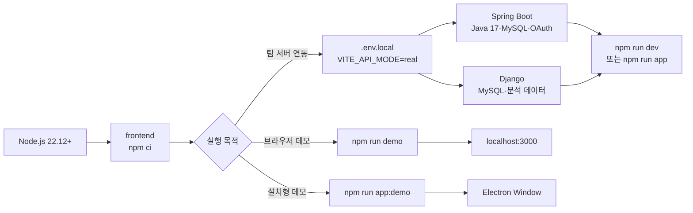

#### 브라우저 데모

```bash
cd frontend
npm ci
npm run demo
```

- 접속 주소: `http://localhost:3000`

#### Electron 데모

```bash
cd frontend
npm ci
npm run app:demo
```

<details>
<summary>Real 모드 환경 변수와 백엔드 실행</summary>

- `frontend/.env.example` → `frontend/.env.local` 복사
- 실제 개발 환경의 Spring Boot·Django·OAuth 주소 지정

```dotenv
VITE_API_MODE=real
VITE_SPRING_API_URL=http://localhost:8080
VITE_DJANGO_API_URL=http://localhost:8000
VITE_OAUTH_URL=http://localhost:8080/api/oauth2/authorization/kakao
```

- **Spring Boot 요구사항**: Java 17, MySQL, `application-secret.yml`
- **민감값 원칙**: 저장소 커밋 제외

- `spring.datasource`: URL, 사용자명, 비밀번호, 드라이버
- `spring.security.oauth2.client`: Kakao OAuth client·provider
- `jwt.secret`
- `app.auth`: token secret, access·refresh 만료 시간
- `app.oauth2.authorized-redirect-uris`
- `cors`: 허용 origin·method·header

```powershell
cd backend/springboot
.\gradlew.bat bootRun
```

- **Django 요구사항**: 동일 MySQL 스키마, `env.production`
- **S3 파일 기능**: `django-storages`, `boto3` 추가 설치

```powershell
cd backend/django
python -m venv .venv
.\.venv\Scripts\Activate.ps1
python -m pip install -r requirements.txt
python -m pip install django-storages boto3
python manage.py runserver 8000
```

- **Django 환경 변수**: `SECRET_KEY`, `DEBUG`, `ALLOWED_HOSTS`, CORS, `DB_*`, AWS S3
- **DB 준비**: 전체 migration·seed 미포함, ERD 기반 스키마·기초 데이터 별도 필요
- **Frontend Real 실행**: 백엔드 기동 후 `npm run dev` 또는 `npm run app`

</details>

### 검증 방법

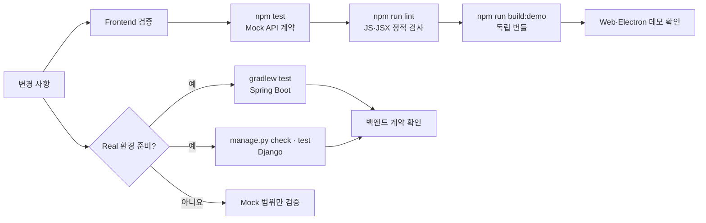

<details>
<summary>Frontend 테스트·린트·데모 빌드</summary>

```bash
cd frontend
npm test
npm run lint
npm run build:demo
```

- `npm test`: Mock 프로필·추천·검색·찜·404 계약
- `npm run lint`: `src` JavaScript·JSX
- `npm run build:demo`: Vite·React 정적 데모 번들

</details>

<details>
<summary>Real 백엔드 검증</summary>

- 환경 파일·개발용 DB 준비 후 실행

```powershell
cd backend/springboot
.\gradlew.bat test

cd ..\django
python manage.py check
python manage.py test
```

- **Spring Boot**: Java 17·secret 설정 필요
- **Django 주의**: `data_analyzer/tests.py`는 데이터 적재 성격의 레거시 코드. 실제 DB 연결 전 내용 확인

</details>

### 프로젝트 범위와 현재 상태

`✅ 즉시 재현` · `△ 별도 환경 필요` · `— 제공 범위 아님`

| 확인 대상 | Mock 데모 | Real 코드 | 상태·제약 |
| --- | --- | --- | --- |
| 기본 실행 | React·Electron 주요 사용자 흐름 | Spring Boot·Django 연동 | ✅ Mock · △ Real |
| 데이터 | 3개 가상 페르소나·샘플 복지·localStorage | MySQL 스키마·기초 데이터 | ✅ Mock · △ Real |
| 외부 의존성 | 백엔드·DB·OAuth 불필요 | MySQL·Kakao OAuth·AWS S3 필요 | ✅ Mock · △ Real |
| 추천 방식 | 조건 기반 규칙 목록 | DBSCAN·코사인·집합·TF-IDF 유사도 | 구현 목적이 다른 두 모드 |
| 추천 평가 | 정답 목록 없음 | 사용자 평가 데이터 없음 | — 정확도·정밀도·재현율 미측정 |
| 자격 판단 | 정보 탐색용 후보 | 정보 탐색용 후보 | — 실제 지원 자격 판정 아님 |
| 자동 검증 | Mock API 테스트·ESLint·Vite 데모 빌드 | Spring test·Django check/test 명령 | ✅ Frontend · △ Backend 환경 |
| 소스 보존 | React·Electron 클라이언트 | Spring Boot·Django 백엔드 | ✅ 저장소 내 보존 |

- **보존 범위**: 2024년 React·Electron 클라이언트와 Spring Boot·Django 백엔드
- **독립 실행**: 서버 없이 핵심 사용자 흐름을 확인하는 Mock 데모
- **탐색 관점**: 화면 구현, API 통합, Desktop 실행 구조, 팀 추천 파이프라인
