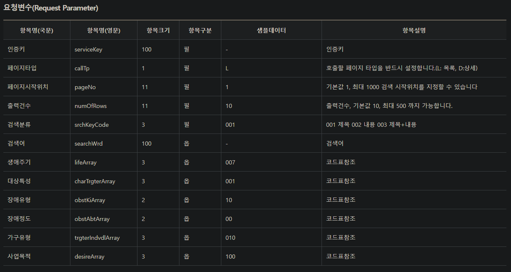
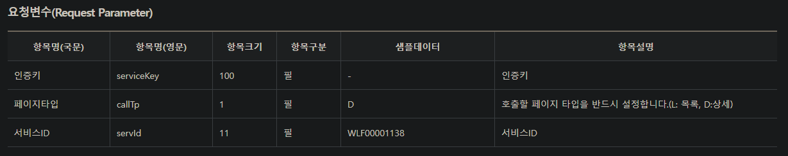

# 한국사회보장정보원 중앙부처복지서비스 API
## 복지서비스 목록조회
### 엔드포인트
http://apis.data.go.kr/B554287/NationalWelfareInformations/NationalWelfarelist  
### 쿼리 파라미터

<table>
    <tr>
        <th>항목명(국문)</th>
        <th>항목명(영문)</th>
        <th>항목크기</th>
        <th>항목구분</th>
        <th>샘플데이터</th>
        <th>항목설명</th>
    </tr>
    <tr>
        <td>인증키</td>
        <td>serviceKey</td>
        <td>100</td>
        <td>필수</td>
        <td>-</td>
        <td>인증키</td>
    </tr>
    <tr>
        <td>인증키</td>
        <td>serviceKey</td>
        <td>100</td>
        <td>필수</td>
        <td>-</td>
        <td>인증키</td>
    </tr>
    <tr>
        <td>인증키</td>
        <td>serviceKey</td>
        <td>100</td>
        <td>필수</td>
        <td>-</td>
        <td>인증키</td>
    </tr>
    <tr>
        <td>인증키</td>
        <td>serviceKey</td>
        <td>100</td>
        <td>필수</td>
        <td>-</td>
        <td>인증키</td>
    </tr>
    <tr>
        <td>인증키</td>
        <td>serviceKey</td>
        <td>100</td>
        <td>필수</td>
        <td>-</td>
        <td>인증키</td>
    </tr>
    <tr>
        <td>인증키</td>
        <td>serviceKey</td>
        <td>100</td>
        <td>필수</td>
        <td>-</td>
        <td>인증키</td>
    </tr>
    <tr>
        <td>인증키</td>
        <td>serviceKey</td>
        <td>100</td>
        <td>필수</td>
        <td>-</td>
        <td>인증키</td>
    </tr>
    <tr>
        <td>인증키</td>
        <td>serviceKey</td>
        <td>100</td>
        <td>필수</td>
        <td>-</td>
        <td>인증키</td>
    </tr>
    <tr>
        <td>인증키</td>
        <td>serviceKey</td>
        <td>100</td>
        <td>필수</td>
        <td>-</td>
        <td>인증키</td>
    </tr>
    <tr>
        <td>인증키</td>
        <td>serviceKey</td>
        <td>100</td>
        <td>필수</td>
        <td>-</td>
        <td>인증키</td>
    </tr>

</table>

## 복지서비스 상세조회
### 엔드포인트
http://apis.data.go.kr/B554287/NationalWelfareInformations/NationalWelfaredetailed
### 쿼리 파라미터
